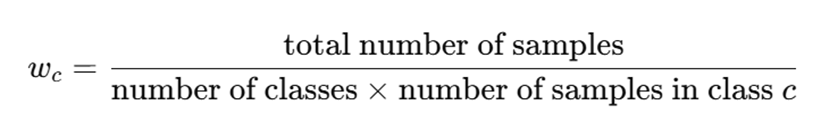

# Pneumonia-Classification-using-Chest-X-Ray-images

## Overview

Pneumonia is a lung infection causing inflamed air sacs filled with fluid or pus. Mainly caused by germs like bacteria , viruses, or fungi which are airbone infections. Pneumonia caused over 15% of global deaths among children under 5 in 2015, totaling 920,000 deaths. The U.S. sees over 1 million hospitalizations and 50,000 deaths annually due to pneumonia. The project goals is to classify pediatric chest X-rays as "Pneumonia" or "Normal" using a deep learning model while leveraging explainable AI to identify contributing factors to the classifications.

## Data Overview

The dataset which was selected for this project is avaliable on Kaggle (link). The X-rays from pediatric patients at Guangzhou Women and Children’s Medical Center, collected during routine clinical care. There are around 5,863 X-ray images (JPEG format) of pediatric patients (1-5 years), classified into Pneumonia and Normal categories. Images were screened for quality, ensuring only high-quality scans were included.

## Data Preprocessing

Data was visulaized and during the data cleaning process it was discovered that the data distribution was not even in train, validation and test datasets. To treat this class imbalance the data was redistributed. After the distribution of the dataset. To mitigate the class imbalance, class weights were assigned. Assigning higher importance to the underrepresented class by adjusting the loss function to penalize incorrect predictions on the minority class more heavily. Below is the formula for class weights calculation.

## Data Transformation

Data Transformations were applied for improving the model's generalization and help it learn robust features before training. Transformations mainly Resizing which standardizes image size (256x256) for consistent input to the model. Also, resize to 256x256: ensures consistent input size, simplifies computation, and enables efficient batching by standardizing dimensions across all images. Othere transformations like grayscale to 3 channels which converts grayscale to 3 channels for compatibility with models expecting RGB input. Finally, normalization which scales pixel values to [-1, 1] for faster, stable training and improved model convergence.

## Deep Learning Models

Deep learning models such as CNN, CNN Advanced, ResNet50, Inception Net, CheXNet, Ensemble of deep learning models were performed on the dataset. CNN model was chosen for its ability to automatically learn spatial hierarchies of features in images, making it ideal for classifying medical images like X-rays with clear patterns for pneumonia. Also, utilized advanced CNN architectures to improve performance by capturing more complex patterns and enhancing generalization, especially for medical image classification. Deep architecture with residual connections such as ResNet50 were performed, avoiding vanishing gradients and enabling learning of fine-grained X-ray features. Pre-trained such as CheXNet which is optimized architecture specifically fine-tuned for pneumonia classification in X-rays by Andrew NG. InceptionNet which uses multiple kernel sizes per layer, capturing features at different scales to detect subtle differences in X-rays. Finally combining models utilizing ensemble techniques for predictions, which improves classification robustness and also reducing overfitting risk.

## Explainable AI

SHAP and LIME overlays can act as a decision support tool to augment radiologists by highlighting suspicious areas, acting as an AI powered "second opinion" with explanations, potentially reducing the chance of missed diagnoses or incorrect diagnoses. It can also play a crucial in medical training and education - training new radiologists by showing what areas of the X-ray to look for before diagnosing the patient. In emergencies like another pandemic, this approach could be used for emergency diagnosis to provide a quick initial assessment with explanations 
The doctor will provide human oversight while leveraging AI capabilities but this can help in quickly filtering out healthy cases and focusing on patients that require urgent care. Overall, this approach shows how explainable AI can make deep learning more practical and trustworthy in medical applications.

## Conclusion

- Pneumonia detection achieved with deep learning models like CNN, ResNet50 and ensemble methods.
- ResNet50 and ensemble model outperformed individual models, providing robust and reliable predictions.
- Explainable AI tools (SHAP, LIME) ensured transparency in model decision-making.
- Addressed class imbalance and standardized data preprocessing for consistent results.
- Future focus: expanding dataset diversity, refining interpretability and clinical integration.

## File Structure

`CNN_Basic.ipynb`: This python file contains the CNN model

`CNN_Improved.ipynb`: This python file contains the CNN advanced model

`Chexnet.ipynb`: This python file contains the ChexNet model

`Ensembling_and_XAI.ipynb`: This python file contains the Ensembleing model

`Inception.ipynb`: This python file contains the InceptionNet model

`Resnet.ipynb`: This python file contains the ResNet50 model

##  Contact Information
For inquiries or feedback, contact:

- Veenaramesh Beknal: veenaramesh.beknal@sjsu.edu

Explore the project and leverage insights from deep learning models on Pneumonia Classification! 

" There is more wisdom in your body than in your deepest philosophy." -- Friedrich Nietzsche